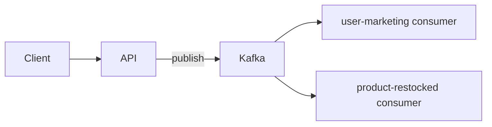

# node-modulith

A TypeScript starter for a **modulith**: one codebase, one Docker image, multiple independently deployable processes (HTTP API + Kafka consumers).

The API handles HTTP traffic and publishes domain events. Consumers subscribe to Kafka topics and run side effects asynchronously. Shared Kafka helpers and message types live in `src/shared/`.

## Architecture



| Process                      | Role                                  | Entrypoint                                       |
| ---------------------------- | ------------------------------------- | ------------------------------------------------ |
| API                          | HTTP server, publishes events         | `src/api/app.ts`                                 |
| `user-marketing-consumer`    | Handles marketing consent updates     | `src/consumers/user-marketing-consumer/index.ts` |
| `product-restocked-consumer` | Handles product restock notifications | `src/consumers/product-restocked/index.ts`       |

In production, each process is a separate ECS service running the **same ECR image** with a different command. Locally, docker compose runs the same topology with hot reload.

## Project layout

```
src/
  api/                    # Express HTTP API
    modules/              # Feature modules (user, product, …)
    lib/kafka.ts          # API-scoped Kafka producer instance
    __tests__/            # API tests
  consumers/
    user-marketing-consumer/
    product-restocked/
  shared/kafka/           # Producer, consumer, topics, message types
```

Path aliases: `@api/*`, `@consumers/*`, `@shared/*` (see `tsconfig.json`).

## Kafka topics

| Topic                    | Published by                           | Consumed by                  |
| ------------------------ | -------------------------------------- | ---------------------------- |
| `user-marketing-consent` | `POST /api/user/:id/marketing-consent` | `user-marketing-consumer`    |
| `product-restocked`      | `POST /api/product/:id/restock`        | `product-restocked-consumer` |

Topics are created on startup by the `kafka-init` compose service (`scripts/kafka/create-topics.sh`). Keep that script in sync with `src/shared/kafka/topics.ts`.

## Local development

**Prerequisites:** Docker, Node 22 (for lint/test outside compose).

```bash
npm install
npm run dev        # docker compose up --build
```

This starts the API (port 3000), both consumers, Kafka, and topic initialization.

| Service | URL / notes                             |
| ------- | --------------------------------------- |
| API     | http://localhost:3000                   |
| Kafka   | `kafka:9092` inside the compose network |

Compose uses the Dockerfile `development` stage with bind mounts and `tsx watch` for hot reload. After adding npm packages locally, reset volumes:

```bash
npm run compose:down && npm run dev
```

### Example requests

```bash
# Update marketing consent (publishes to user-marketing-consent)
curl -X POST http://localhost:3000/api/user/1/marketing-consent \
  -H 'Content-Type: application/json' \
  -d '{"accepts_marketing": true}'

# Restock a product (publishes to product-restocked)
curl -X POST http://localhost:3000/api/product/1/restock \
  -H 'Content-Type: application/json' \
  -d '{"quantity": 60}'
```

## Scripts

| Command                | Description                           |
| ---------------------- | ------------------------------------- |
| `npm run dev`          | Start full stack via docker compose   |
| `npm run compose:down` | Tear down compose (including volumes) |
| `npm run compile`      | TypeScript build → `dist/`            |
| `npm run lint`         | ESLint                                |
| `npm run test`         | Vitest unit tests                     |
| `npm run format`       | Prettier                              |

## Testing

Tests live in a `__tests__/` folder per deployable unit:

- `src/api/__tests__/`
- `src/consumers/<name>/__tests__/`

`tsconfig.json` includes tests for editor support; `tsconfig.build.json` excludes them from production output.

## Local vs. production topology

Same image and code, different infrastructure running it:

| Concern     | Local (docker compose)                                                                                                                     | Production (AWS)                                                                                                                   |
| ----------- | ------------------------------------------------------------------------------------------------------------------------------------------ | ---------------------------------------------------------------------------------------------------------------------------------- |
| Processes   | `api`, `user-marketing-consumer`, `product-restocked-consumer` as separate compose services, built from the `development` Dockerfile stage | Same three processes as separate ECS services, running the `runtime` stage of the **same** ECR image with a different command each |
| Kafka       | Single-broker `apache/kafka` container (`kafka` service), topics created on startup by `kafka-init`                                        | Managed MSK cluster                                                                                                                |
| Networking  | One `internal-net` bridge network; services reach each other by compose service name (e.g. `kafka:9092`)                                   | ECS services on AWS networking, talking to MSK brokers                                                                             |
| Code reload | Bind-mounted source + `tsx watch` for hot reload                                                                                           | No mounts — image is built once in CI and deployed as-is                                                                           |

## CI/CD / Production Pipeline

Quick mental model:

```
GitHub Actions → ECR (one image) → ECS (api + consumer services) → MSK
```

On every push/PR to `main`, `.github/workflows/ci-cd.yml` runs:

1. **`run-linter`** and **`run-tests`** — ESLint and the Vitest suite, in parallel.
2. **`build-and-push-image`** — only on a push to `main` (not PRs), and only when the `DEPLOYS_ENABLED` repo variable isn't set to `false`. Builds the `runtime` stage of the Dockerfile and pushes it to ECR tagged both with the git SHA and `main`.
3. **`deploy-to-ecs`** — fans out over a matrix of the three services (`api`, `user-marketing-consumer`, `product-restocked-consumer`). For each one it downloads the current ECS task definition, renders the new image into it, and deploys the updated task definition to the corresponding ECS service, waiting for the service to pull the image from ECR, run the container and stabilize before the job succeeds.

Setting the `DEPLOYS_ENABLED` repo variable to `false` skips steps 2 and 3, so lint/test still run but no new image is built or deployed.
